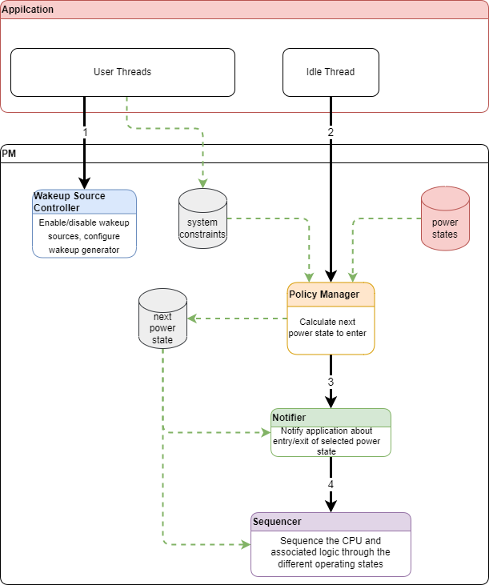

# Power Manager Framework Guild

1. [Introduction](#introduction) 
2. [Architecture And Details](#architecture-and-details)
    - [Overview](#overview)
    - [Details](#details)
        + [Implementation of Wakeup Source Manager](#wakeup-source-manager)
        + [Implementation of Policy Manager](#policy-manager)
        + [Implementation of Notifier](#notifier) 
        + [Implementation of Sequencer](#sequencer)
    - [Multi-core Support](#multi-core-support) 
        + [Symmetric Multi-core](#symmetric-multi-core)
        + [Asymmetric Multi-core](#asymmetric-multi-core) 
3. [Porting Guild](#porting-guild) 

# Introduction <a id="introduction"></a>

In NXP MCU families, different MCUs may have varying power architectures, resulting in different power drivers. This can make it time-consuming for users to understand the new power architecture when switching to a new MCU, and their existing code may not be compatible with the new MCU. Even the NXP internal middleware and stack team is experiencing these.

To address this problem, SDK introduce the Power Manager framework. This framework is designed to abstract the underlying power drivers and provide a unified power management interface for different MCUs. This simplifies the process of porting power management code between different MCUs, as the user only needs to learn and use the Power Manager framework instead of the specific power drivers of each MCU.

This document explains the architecture and details of the Power Manager framework. Additionally, it provides guidance on how to enable the Power Manager framework on a specific device.

# Architecture And Details  <a id="architecture-and-details"></a>

## Overview <a id="overview"></a>

The Power Manager Framework, as shown in Figure 1, is an innovative software framework that plays a crucial role in developing stacks or applications. To ensure that the power manager framework adapts to different MCU families, it adopts a layered architecture.

The power manager core layer provides several unified APIs for upper software (stacks or applications). Meanwhile, for different MCU families, the power manager device layer abstracts power features by wrapping up device-specific clock drivers, power drivers, and wakeup-related drivers.

Moreover, the Power Manager Framework ensures that the system operates efficiently by safely managing transitions to and from power-saving states. The upper layer software only needs to use the APIs of the Power Manager Framework, reducing the complexity of the software development process and improving overall system performance.


Figure1: Power Manager Framework Overview

## Details <a id="details"></a>

The power manager framework is comprised of four sub-modules: Wakeup Source Manager, Policy Manager, Notifier, and Sequencer.

**Wakeup Source Manager:** This submodule handles a device's wakeup capability as a wakeup source. It can enable or disable this capability and process the registered wakeup source handler callback.

**Policy Manager:** This submodule determines the next power state to enter based on enabled policies. 

**Notifier:** This submodule allows upper layer software to be notified of specific power transitions using the callback mechanism. Some hardware peripherals may require several steps to enter or exit the low power mode, so multiple callbacks are necessary to avoid undesired waiting loops. The power manager framework has three groups of notification sets. The power manager executes registered notification callback functions from group 0 to group 2 before entering low power mode, and from group 2 to group 0 after exiting low power mode.

**Sequencer:** This submodule manages the entry of selected power states in a system. It is an integral part of the power management system, and it helps ensure that power is distributed properly throughout the system.

Figure 2 illustrates the workflow of the power manager framework’s sub-modules used in RTOS system. The black line represents the sleep flow, and the red line represents the wake-up flow.

As the figure2 shows, the power manager framework's entry is used in the Idle thread. It is critical to enable the wakeup source by using the Wakeup Source Manager submodule to set the correct configuration to the wakeup generator and peripherals.

When the system has nothing to schedule, the Idle thread will be scheduled automatically, and the sleep workflow is launched.

The **Policy Manager** calculates the appropriate power state (referred to as the "next power state" in Figure 3) to enter by comparing the current system constraints (set by other threads) and the low power duration with the defined information for different power states. The **Notifier** then invokes the registered callback function in the order specified by other threads to notify of the entry into the selected power state. The upper-level software can decline entry into the selected power state in this step. Finally, the Sequencer module sets the MCU into the "next power state".

When the configured wakeup event occurs, the MCU wakes from the low power state, and the **Notifier** invokes the registered callback function in order to notify the exit of the selected power state.

> **Note that if the device wakes through the reset routine, the Notifier will not be invoked.**
> 

Let's focus on Figure 3. The most critical variable in the power manager framework is the "next power state," which is calculated by the policy module. It represents the lowest power state that the current system can enter at the current time point. This variable is then transferred to the notifier, which notifies the entry/exit of the "next power state." Finally, the sequencer sets the device into the calculated "next power state.”


Figure 2: Power Manager Framework Work Flow



Figure 3: SDK Power Manager Framework Data Flow

Figure 3 shows the invocation flow of the power manager framework interfaces, following the workflow and layer division of the power manager framework. The device layer of the power manager framework is an abstraction of the MCU wakeup feature and power feature. To enable the power manager framework, it is essential to implement `device→manageWakeupSource()` and `device→enter()`.


Figure 4: Power Manager Framework Invoke Flow

### Implementation of Wakeup Source Manager <a id="wakeup-source-manager"></a>

This submodule allows for enabling or disabling the wakeup capability and processing the registered wakeup source handler callback. In some MCUs, to implement very aggressive low-power states, both the CORE and some power domains may be powered down. Since no interrupts can normally reach the CORE, it is necessary to use additional logic that enables a subset of peripherals to wake up the CORE. This is known as the wakeup generator.

In the KWxx family, WUU/LLWU is used as the wakeup generator, while in the RT1xxx family, GPC acts as the wakeup generator. As shown in Figure 5, if the MCU is equipped with a "wakeup source generator," then the wakeup source manager should be able to configure it.


Figure 5: Wakeup Source Manager Implementation 

```c
/*!
 * @brief Wakeup source service function used with PM_RegisterWakeupSource() function.
 */
typedef void (*pm_wake_up_source_service_func_t)(void);

/*!
 * @brief Wakeup source object structure.
 *
 * In PM_RegisterWakeupSource(), the wakeup source object in this structure type is allocated from the heap.
 * In PM_UnregisterWakeupSource(), the wakeup source object in this structure type is destoried from the heap.
 */
typedef struct _pm_wakeup_source
{
    list_element_t link; /*!< For placing on the wake up source list. */
    uint32_t wsId; /*!< The wakeup source id that the MCU supports, this value is used to config wakeup source manager
                      hardware peripheral. NXP will provided wakeup source id for each specific MCU. */
    pm_wake_up_source_service_func_t service; /*! Wakeup source service function that should be executed if the
                                    corresponding wakeup event occurred. */
    bool enabled : 1U;                        /*!< Enable/disable wakeup source. */
    bool active : 1U;                         /*!< Indicate whether the corresponding wakeup event occurs. */
} pm_wakeup_source_t;

/*!
 * @brief Handle structure for power manager.
 *
 */
typedef struct _pm_handle
{
#if (defined(FSL_PM_SUPPORT_WAKEUP_SOURCE_MANAGER) && FSL_PM_SUPPORT_WAKEUP_SOURCE_MANAGER)
    list_label_t wakeupSourceList;
#endif /* FSL_PM_SUPPORT_WAKEUP_SOURCE_MANAGER */

		... //Other Members
} pm_handle_t;
```

Snippet 1 shows the important structure of the wakeup source manager. The wakeup source is abstracted as the `pm_wakeup_source_t` structure, which contains the essential member `wsId`. `wsId` represents the ID of the wakeup source that the device supports. Lists of `wsId` that the device supports are provided in the power manager framework's device layer in the form of macros. Snippets 2 and 3 show examples of wakeup source IDs in different devices.

The `PM_ENCODE_WAKEUP_SOURCE_ID` macro encodes critical information into `wsId` to configure corresponding settings in the wakeup generator and NVIC. The definition of this macro may be different due to different wakeup generators.

```c
// Wakeup Source Id defined for KW45
#define PM_WSID_PTA0_RISING_EDGE PM_ENCODE_WAKEUP_SOURCE_ID(0UL, 0UL, PORTA_EFT_IRQn, 1UL)
#define PM_WSID_PTA0_Falling_EDGE PM_ENCODE_WAKEUP_SOURCE_ID(0UL, 0UL, PORTA_EFT_IRQn, 2UL)
#define PM_WSID_PTA0_ANY_EDGE PM_ENCODE_WAKEUP_SOURCE_ID(0UL, 0UL, PORTA_EFT_IRQn, 3UL)

// Encode wakeup source Id for KW45
/*!
 * inputType: 4 bit width. Used to distinguish WUU input source type, 0 for external pins, 1 for internal modules.
 * inputId:   4 bit width. The id of WUU input.
 * irqn:      8 bit width. The irq number of wuu input.
 * misc:      Misc usage, if input type is external pin, this field is used to store edge detection type.
 *            01b -- External input pin enabled with rising edge detection.
 *            10b -- External input pin enabled with falling edge detection.
 *            11b -- External input pin enabled with any change detection.*/
#define PM_ENCODE_WAKEUP_SOURCE_ID(inputType, inputId, irqn, misc)                        \
    (((inputType)&0xFUL) | (((inputId) << 4UL) & 0xF0UL) | (((irqn) << 8UL) & 0xFF00UL) | \
     ((misc << 16UL) & 0xFFFF0000UL))
```

```c
// Wakeup Source Id defined for RT1170
#define PM_WSID_DMA0_DMA16_IRQ               PM_ENCODE_WAKEUP_SOURCE_ID(DMA0_DMA16_IRQn)     /*!< DMA channel 0/16 transfer complete, available for CM4 and CM7. */
#define PM_WSID_DMA1_DMA16_IRQ               PM_ENCODE_WAKEUP_SOURCE_ID(DMA1_DMA17_IRQn)     /*!< DMA channel 1/17 transfer complete, available for CM4 and CM7. */
#define PM_WSID_DMA2_DMA18_IRQ               PM_ENCODE_WAKEUP_SOURCE_ID(DMA2_DMA18_IRQn)     /*!< DMA channel 2/18 transfer complete, available for CM4 and CM7. */
#define PM_WSID_DMA3_DMA19_IRQ               PM_ENCODE_WAKEUP_SOURCE_ID(DMA3_DMA19_IRQn)     /*!< DMA channel 3/19 transfer complete, available for CM4 and CM7. */
#define PM_WSID_DMA4_DMA20_IRQ               PM_ENCODE_WAKEUP_SOURCE_ID(DMA4_DMA20_IRQn)     /*!< DMA channel 4/20 transfer complete, available for CM4 and CM7. */

// Encode wakeup source Id for RT1170
#define PM_ENCODE_WAKEUP_SOURCE_ID(irqId) (irqId)
```

### Implementation of Policy Manager <a id="policy-manager"></a>

This submodule calculates the suitable power state to enter and is implemented in power manager's core layer. The current implementation supports two policies, as shown in Figure 6:

- Low power duration policy: The power management framework selects the power state that provides the highest power savings while ensuring a minimum exit latency that is less than or equal to the system's low power duration.
- Constraints policy: Based on MCU hardware mechanisms, we discovered that in a specific low-power state, some basic resources (clock source, power supply, power domain, RAM) must be set to a certain operating mode. For instance, in KW45, the clock source FRO_192M is disabled in deep sleep mode, but the clock source FRO_6M remains operational in deep sleep mode. This policy exploits this characteristic by abstracting the basic resource operating mode into two lists for the specific power state: one list contains all basic resources that must be disabled in this state, and another list contains other basic resources that can still be operational. The term 'constraint' represents the application's requirement that the selected basic resource works in the chosen operating mode. For example, the constraint `PM_RESC_FRO_6M_ON` means the application requires FRO_6M to remain operational even in low power states. This policy compares all constraints with the specific power state's two lists and finds the highest power savings state that satisfies all constraints.

Snippet 4 illustrates the structures utilized for the policy manager. `pm_state_t` represents the device's power states, while `pm_device_option_t` represents a specific device. Since a device may have different power states, the array `states[PM_LP_STATE_COUNT]` is used to store the device's power states.

Within the `pm_state_t` structure, the `exitLatency` member is utilized for the Low Power Duration Policy. It represents the time taken to exit from the specific low power state to the normal run state. The `fixConstraintsMask` member contains the list of basic resources that must be disabled in the specific power state, while the `varConstraintsMask` member contains the list of basic resources that remain operational in the specific power state.


Figure 6: Policy Manager Implementation

```c
/*!
 * @brief The definition of Power manager resource constraint group, the group contains the operation mode of each
 * constraint.
 */
typedef struct _pm_resc_group
{
    uint32_t groupSlice[PM_RESC_GROUP_ARRAY_SIZE];  /*!< The resource constraint group. */
} pm_resc_group_t;

/*!
 * @brief The definition of power manager resource constraint mask.
 */
typedef struct _pm_resc_mask
{
    uint32_t rescMask[PM_RESC_MASK_ARRAY_SIZE]; /*!< The resource constraint mask. */
} pm_resc_mask_t;

/*!
 * @brief The abstraction of MCU power state.
 */
typedef struct _pm_state
{
    uint32_t exitLatency;              /*!< The latency that the power state need to exit, in us */
    pm_resc_mask_t fixConstraintsMask; /*!< Some constraints that must be satisfied in the power state. */
    pm_resc_mask_t varConstraintsMask; /*!< Some optional and configurable constraints. */
} pm_state_t;

/*!
 * @brief Device power related options., including power states array, power state counts.
 *
 */
typedef struct _pm_device_option
{
    pm_state_t states[PM_LP_STATE_COUNT]; /*!< The array of device's power state, states array must be ordered in
                                            decreasing power consumption. */
    uint8_t stateCount;                    /*!< The counts of device's power state. */
		... //Other Members
} pm_device_option_t;

/*!
 * @brief Handle structure for power manager.
 *
 */
typedef struct _pm_handle
{
    
    pm_resc_mask_t resConstraintMask;                /*!< Current system's resource constraint mask. */
    pm_resc_mask_t softConstraints;                  /*!< Current system's optional resource constraint mask. */
    uint8_t resConstraintCount[PM_CONSTRAINT_COUNT]; /*!< The count of each resource constraint, if the constraint's
                                                    count is 0, it means the system has removed that contraint. */

    pm_resc_group_t sysRescGroup; /*!< Current system's resource constraint group. */

    uint8_t powerModeConstraint;                         /*!< Used to store system allowed lowest power mode. */
    uint8_t powerModeConstraintCount[PM_LP_STATE_COUNT]; /*!< The count of each power mode constraint. */
		... //Other Members
} pm_handle_t;
```

### Implementation of Notifier <a id="notifier"></a>

This submodule is responsible for notifying upper-layer software about the entry or exit of the calculated power state and is implemented in power manager’s core layer. The notifier is implemented using a callback mechanism, and upper-layer software can refuse to enter the calculated power state by returning `kStatus_PMFail`.

The power manager framework supports three groups of notifiers, in case the operation of peripheral A depends on the operation of peripheral B. Each group is implemented using a list component. Before entering the power state, group 0 is executed first, followed by group 1, and finally group 2. After exiting from the power state, group 2 is executed first, followed by group 1, and finally group 0.

Snippet 5 contains the structure for the notifier. Each group of notifiers contains elements of type `pm_notify_element_t`. This type of element stores the callback function registered by the upper-layer software. In principle, any number of elements can be defined (limited only by available RAM).

```c
 /*!
 * @brief Power manager event type, used in notification module to inform the upper layer software
 * of the power transition event.
 */
typedef enum _pm_event_type
{
    kPM_EventEnteringSleep = 0U, /*!< Entering a sleep state. */
    kPM_EventExitingSleep,       /*!< Exiting a sleep state. */
} pm_event_type_t;

/*!
 * @brief The enumeration of notification group.
 */
typedef enum _pm_notify_group
{
    kPM_NotifyGroup0 =
        0U,           /*!< Notify group0, before entering power state the notifiers in group0 are executed firstly. */
    kPM_NotifyGroup1, /*!< Notify group1. */
    kPM_NotifyGroup2, /*!< Notify group2, after exiting power state the notifiers in group2 are executed firstly. */
} pm_notify_group_t;

/*!
 * @brief Power manager notify callback function used with the PM_RegisterNotify() API.
 *
 * @param eventType Identify the type of power event.
 * @param powerState The power state which will enter into, actually it is the index of states array
 * in @ref pm_device_option_t structure.
 * @param data      Pointer to a custom argument.
 */
typedef status_t (*pm_notify_callback_func_t)(pm_event_type_t eventType, uint8_t powerState, void *data);

/*!
 * @brief Power manager notify object structure.
 */
typedef struct _pm_notify_element
{
    list_element_t link;                      /*!< For placing on the notify list. */
    pm_notify_callback_func_t notifyCallback; /*!< Registered notification callback function.  */
    void *data;                               /*!< Pointer to a custom argument. */
} pm_notify_element_t;

/*!
 * @brief Handle structure for power manager.
 *
 */
typedef struct _pm_handle
{
#if (defined(FSL_PM_SUPPORT_NOTIFICATION) && FSL_PM_SUPPORT_NOTIFICATION)
    list_label_t notifyList[3U];           /*!< The header of 3 group notification. */
    pm_notify_group_t curNotifyGroup;      /*!< Store current notification group. */
    pm_notify_element_t *curNotifyElement; /*!< Store current notification element. */
#endif                                     /* FSL_PM_SUPPORT_NOTIFICATION */
	... //Other Members
} pm_handle_t;
```

### Implementation of Sequencer <a id="sequencer"></a>

This sub-module is the most important part of the power manager framework. It is responsible for setting power supplies, configuring RAM operation modes, gating clock sources, controlling power domains, and sequencing system modes. In summary, all low-power related settings are configured in this module by invoking SDK drivers. All these features are unified into one function: **`pm_device_option_t→enter()`**, as shown in snippet 6. To enable the power manager framework for a specific device, a device-specific definition of `pm_device_option_t->enter()` must be provided in the power manager framework's device layer.


Figure 7: Implementation of sequencer

```c
/*!
 * @brief Device power related options., including power states array, power state counts.
 *
 */
typedef struct _pm_device_option
{

    void (*enter)(uint8_t powerState, pm_resc_mask_t *pSoftRescMask, pm_resc_group_t *pSysRescGroup);   /*!< enter power state */
    void (*clean)(void);                  /*!< clean after power state transition */
		... //Other Members
} pm_device_option_t;
```

## Multi-core Support <a id="multi-core-support"></a>

### Symmetric Multi-core <a id="symmetric-multi-core"></a>

In symmetric multi-core systems, different cores have the same architecture and share the main memory. They have full access to all input and output devices. Typically, these different cores are controlled by a single operating system instance that treats all processors equally. MCXN10 is a typical example of a symmetric multi-core system.

When developing real-time operating system (RTOS) applications that support symmetric multiprocessing (SMP), one instance of a power manager (PM) is used, with the main core responsible for invoking the PM's APIs. The second core should be treated as a resource instance, and constraints should be set to ensure it is active before scheduling specific threads to it. Once threads on the second core are completed, the constraints of the second core should be released, and the main core's idle task should enter low power mode. For bare-metal applications, the main core communicates with the second core, sets constraints to ensure the second core is active before booting it, and releases constraints of the second core after it becomes idle.

### Asymmetric Multi-core <a id="asymmetric-multi-core"></a>

In asymmetric multi-core systems, different cores have different architectures, different interrupt lines, and a block of memory may be shared. RT1170 is a typical example of an asymmetric multi-core system.

When developing applications for this type of MCU, two instances of the power manager (PM) are used, and each core is responsible for invoking its own PM's APIs. This architecture is useful when different cores need to perform different functions, and the system requires more flexibility. For most Asymmetric Multi-core MCUs, the MCU may be equipped with hardware policies to handle different requests from different cores. This provides a way to manage the activities of different cores and ensure that the system performs optimally.

# Porting Guild <a id="porting-guild"></a>

To enable the power manager for a new device, create a new folder under ***mcu-sdk-2.0\components\power_manager\devices\*** for the new device. For instance, to enable the power manager for RT1170, follow the steps below:

1. Create a new folder for the device. Add the required files, as shown in Figure 8.


Figure 8: Files for device

- The following files are related to the power manager of a specific device:
- ChangeLogKSDK.txt: This file contains the changelog.
- fsl_pm_device_config.h: This file contains configuration-related macros.
- fsl_pm_device.c: This file should provide an implementation of `pm_device_option_t`.
- fsl_pm_device.h: This file contains definitions of the device's constraints and wakeup source ID.
- DEVICE_README.md: This file is optional. It should be provided if the device requires additional settings to reach the current consumption value in DS.

1. To configure a specific device, overwrite the common configurations defined in **components\power_manager\core\fsl_pm_config.h** in **fsl_pm_device_config.h**. The following definitions must be provided for the new device:
    1. `PM_CONSTRAINT_COUNT`: The number of constraints for the new device.
    2. `PM_LP_STATE_COUNT`: The number of power states for the new device.
    3. `FSL_PM_SUPPORT_NOTIFICATION`: Disabled by default. The device can enable the notifier by overwriting the default setting.
    4. `FSL_PM_SUPPORT_WAKEUP_SOURCE_MANAGER`: Disabled by default. The device can enable the wakeup source manager by overwriting the default setting.
    5. `FSL_PM_SUPPORT_LP_TIMER_CONTROLLER`: Disabled by default. The device can enable this feature by overwriting the default settings.
2. Define macros for the device's power mode, device's constraints, and device's wakeup source ID in **fsl_pm_device.h**:
    1. Define power mode using macros starting with ‘PM_LP_STATE’. Upper-layer software can use these macros to set the lowest allowed power state.
        
        E.g.
        
        ```c
        /*!
         * @name Power Mode Definition
         * @{
         */
        #define PM_LP_STATE_SP0  (0U)  /*!< Low power state 0, setpoint 0. */
        #define PM_LP_STATE_SP1  (1U)  /*!< Low power state 1, setpoint 1. */
        #define PM_LP_STATE_SP2  (2U)  /*!< Low power state 2, setpoint 2. */
        #define PM_LP_STATE_SP3  (3U)  /*!< Low power state 3, setpoint 3. */
        #define PM_LP_STATE_SP4  (4U)  /*!< Low power state 4, setpoint 4. */
        #define PM_LP_STATE_SP5  (5U)  /*!< Low power state 5, setpoint 5. */
        #define PM_LP_STATE_SP6  (6U)  /*!< Low power state 6, setpoint 6. */
        #define PM_LP_STATE_SP7  (7U)  /*!< Low power state 7, setpoint 7. */
        #define PM_LP_STATE_SP8  (8U)  /*!< Low power state 8, setpoint 8. */
        #define PM_LP_STATE_SP9  (9U)  /*!< Low power state 9, setpoint 9. */
        #define PM_LP_STATE_SP10 (10U) /*!< Low power state 10, setpoint 10. */
        #define PM_LP_STATE_SP11 (11U) /*!< Low power state 11, setpoint 11. */
        #define PM_LP_STATE_SP12 (12U) /*!< Low power state 12, setpoint 12. */
        #define PM_LP_STATE_SP13 (13U) /*!< Low power state 13, setpoint 13. */
        #define PM_LP_STATE_SP14 (14U) /*!< Low power state 14, setpoint 14. */
        #define PM_LP_STATE_SP15 (15U) /*!< Low power state 15, setpoint 15. */
        #define PM_LP_STATE_SNVS (16U) /*!< Low power state 16, SNVS. */
        
        #define PM_LP_STATE_NO_CONSTRAINT (0xFFU)
        ```
        
    2. Define macros of constraints that start with 'PM_RESC_'. As previously mentioned, constraints in the power manager are defined as the operating mode of basic resources. For example:
        
        ```c
        /*!
         * @brief Resource constraints definition of CPU platform (suitable for CM7 and CM4 processors), with support for four
         * modes:
         *   1. The CPU domain is in run mode, core is active and cache, TCM, and peripherals inside the CPU platform can be accessed when needed,
         *       as specified in @ref PM_CORE_DOMAIN_RUN;
         *   2. The CPU domain is in wait mode, clocks to the CPU core and cache are gated off, as specified in @ref PM_CORE_DOMAIN_WAIT;
         *   3. The CPU domain is in stop mode, clocks to the CPU core, cache, and TCM are gated off, as specified in @ref PM_CORE_DOMAIN_STOP;
         *   4. The CPU platform is powered off, as specified in @ref PM_CORE_DOMAIN_SUSPEND.
         */
        #define PM_RESC_CORE_DOMAIN_RUN            PM_ENCODE_RESC(PM_RESOURCE_FULL_ON, kResc_CPU_PLATFORM)
        #define PM_RESC_CORE_DOMAIN_WAIT           PM_ENCODE_RESC(PM_RESOURCE_PARTABLE_ON1, kResc_CPU_PLATFORM)
        #define PM_RESC_CORE_DOMAIN_STOP           PM_ENCODE_RESC(PM_RESOURCE_PARTABLE_ON2, kResc_CPU_PLATFORM)
        #define PM_RESC_CORE_DOMAIN_SUSPEND        PM_ENCODE_RESC(PM_RESOURCE_OFF, kResc_CPU_PLATFORM)
        
        /*!
         * @brief List  of system basic resources that controlled by PM.
         */
        enum _resc_name
        {
            /* Controlled by GPC_CMC. */
            kResc_CPU_PLATFORM = 0U, /*!< CPU platform, this resource is suitable for CM7 and CM4. */
        
        		...//Other basic resource Id.
        };
        ```
        
        Snippet8 displays the constraints for the core domain in RT1170. Each constraint includes two factors: operating mode and basic resource ID. These two factors are encoded by `PM_ENCODE_RESC()`. The power manager provides a default definition for this encoding, but the device can overwrite it. Basic resource IDs should be listed in an `enum _resc_name` starting from `0U`. Operating modes are defined in ***components\power_manager\core\fsl_pm_config.h***. The current implementation supports four levels of operating mode:
        
        - `PM_RESOURCE_FULL_ON`: The resource is fully ON;
        - `PM_RESOURCE_PARTABLE_ON2`: The resource is partially ON2, with some features limited;
        - `PM_RESOURCE_PARTABLE_ON1`: The resource is partially ON1, with more features limited than in partable ON2;
        - `PM_RESOURCE_OFF`: The resource is totally turned off.
        
        The constraint `PM_RESC_CORE_DOMAIN_SUSPEND` indicates that the CPU platform needs to be turned off.
        
    3. Define macros for wakeup source IDs that should start with 'PM_WSID_'. For example:
        
        ```c
        #define PM_WSID_CORE_IRQ                     PM_ENCODE_WAKEUP_SOURCE_ID(CORE_IRQn)          /*!< Core platform exception IRQ, available for CM4 and CM7. */
        #define PM_WSID_LPUART1_IRQ                  PM_ENCODE_WAKEUP_SOURCE_ID(LPUART1_IRQn)       /*!< LPUART1 interrupt, available for CM4 and CM7. */
        ```
        
        The Wakeup Source ID is mainly used to set the Wakeup Generator using `PM_ENCODE_WAKEUP_SOURCE_ID`. The Power Manager provides the default definition in ***components\power_manager\core\fsl_pm_config.h***, but the device can overwrite the definition in ***fsl_pm_device_config.h***.
        

4. Implement the `g_devicePMOption` global constant for the new device. For example:

```c
const pm_device_option_t g_devicePMOption = {
    .states =
        {
            /* setpoint 0 */
            {
                .exitLatency = 6400UL, // From setpoint 0 standby suspend to setpoint 0 run mode.s
                /* In setpoint 0, following basic resources will be disabled:
                 *  kResc_OSC_RC_48M, kResc_OSC_RC_48M_DIV2, kResc_SYS_PLL1, kResc_SYS_PLL1_CLK, kResc_SYS_PLL1_DIV2,
                 *  kResc_SYS_PLL1_DIV5, kResc_FBB_M7, kResc_RBB_SOC, kResc_RBB_LPSR, kResc_LPSR_ANA_LDO,
                 * kResc_LPSR_DIG_LDO
                 */
                .fixConstraintsMask =
                    {
                        .rescMask[0] = 0x3C0000CUL,
                        .rescMask[1] = 0x1D8UL,
                    },
                /*
                 * In setpoint 0, following basic resources are optional, application can set this to different
                 * operation modes: kResc_CPU_PLATFORM, kResc_STBY_REQ. Please note in default, CPU platform will
                 * powered off, and standby request will be assert.
                 */
                .varConstraintsMask =
                    {
                        .rescMask[0] = 0x1UL,
                        .rescMask[1] = 0x200UL,
                    },
            },
						... //Other power states
        },
    .stateCount = 17U,
    .prepare    = RT1170_PreparePowerSetting,
    .enter      = RT1170_EnterPowerState,
    .clean      = NULL,
#if (defined(FSL_PM_SUPPORT_WAKEUP_SOURCE_MANAGER) && FSL_PM_SUPPORT_WAKEUP_SOURCE_MANAGER)
    .manageWakeupSource = RT1170_ManageWakeupSource,
    .isWakeupSource     = RT1170_IsWakeupSource,
#endif /* (defined(FSL_PM_SUPPORT_WAKEUP_SOURCE_MANAGER) && FSL_PM_SUPPORT_WAKEUP_SOURCE_MANAGER) */
};
```

- `.states`: This is an array of all power states in the `pm_state_t` type that the new device supports.
- `.stateCount`: This is the count of power states listed in the `states` array.
- `.prepare`: This is a device-specific function used to configure pre-defined values that only need to be set once.
- `.clean`: This is a device-specific function used to clean some register settings after waking from a low power state.
- `.manageWakeupSource`: This is a device-specific function used to configure the wakeup generator and NVIC.
- `.isWakeupSource`: This is a device-specific function used to check the wakeup source.
1. Update the change log for the new device.
2. Update ***add_power_manager_v3.yml*** to record information about a new device.
3. Enable the **power_manager_test** demo for the new device, and ensure that the current consumption of the demonstrated power state aligns with the value in the DS.
